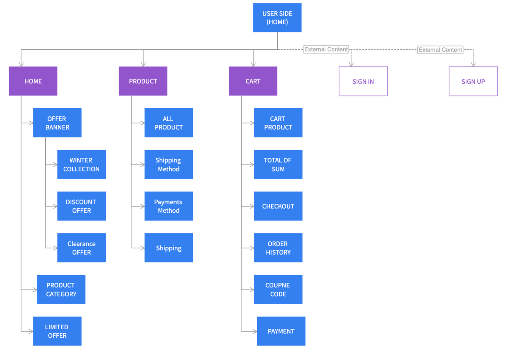
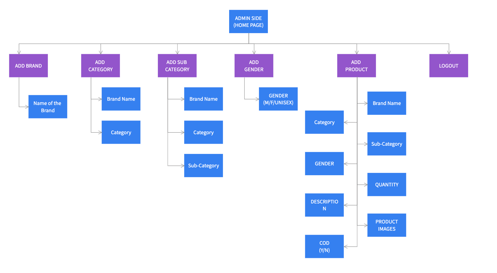

# E-commerce-Website

Hello Everyone, This project is based on E-Commerce Website. Through the Website I created the two side: 
1. Admin Panel
2. User Panel

Project is developed using the HTML, CSS, Bootstrap, JavaScript, ASP.NET and SQL Database. With Using Microsoft Visual Studio 2015.

# Flow Chart(User Side)
 

  

 

# Flow Description

1. Register User account
2. Log In User

3. Check the Home Page

4. Select the Product from Product Page

5. Go to the Individual Product
6. Choose your suitable Size
7. Press Add Cart

8. Go to Cart
9. Check your Total Amount
10. Choose your Payment Method

# Flow Chart(Admin Side)
 

  

 

For more details Contact me on [LinkedIn](https://www.linkedin.com/in/sagarkumar-limbasiya-9930a8188/)
